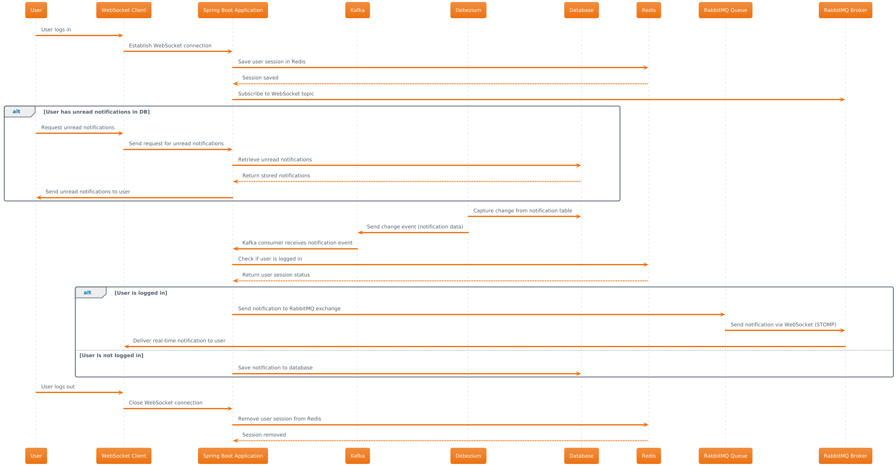

# Real-Time Notification System

This project is a real-time notification system built using Spring Boot, Kafka, Debezium, Redis, RabbitMQ, and WebSocket with the STOMP protocol. It captures database changes, processes notifications, and delivers them to users in real-time.

## Table of Contents

- [Architecture](#architecture)
- [Features](#features)
- [Technologies](#technologies)
- [Configuration](#configuration)
- [Usage](#usage)

## Architecture

The system is designed to handle real-time notifications with the following components:

1. **Debezium & Kafka Connect:** Captures changes from the `notification` table in the database and sends them to a Kafka topic.
2. **Kafka Consumer:** Consumes messages from the Kafka topic and checks the user's login status using Redis.
3. **Redis:** Manages user session data to determine if users are logged in.
4. **Database:** Stores notifications for users who are not logged in.
5. **RabbitMQ:** Acts as a WebSocket broker to facilitate real-time communication.
6. **WebSocket & STOMP:** Delivers notifications in real-time to logged-in users.

## Features

- **Real-time Notifications:** Logged-in users receive notifications instantly via WebSocket.
- **Session Management:** User sessions are managed using Redis, allowing efficient login checks.
- **Database Persistence:** Notifications are stored for users who are not logged in, ensuring no notifications are missed.
- **Scalable Architecture:** Utilizes Kafka for efficient message handling and RabbitMQ for scalable WebSocket communication.

## Technologies

- **Spring Boot:** Manages the application's business logic and service integrations.
- **Kafka & Kafka Connect:** Facilitates message-driven architecture and real-time data processing.
- **Debezium:** Captures changes from the database in real-time.
- **Redis:** Manages session data for quick access.
- **RabbitMQ:** Used as a broker for WebSocket communication.
- **WebSocket & STOMP:** Provides real-time messaging capabilities.

## Configuration

The main configurations for this project can be found in the `src/main/resources/application.yml` file. Key configurations include:

- **Kafka Settings:** `spring.kafka.bootstrap-servers`, `spring.kafka.consumer.group-id`
- **Redis Settings:** `spring.redis.host`, `spring.redis.port`
- **RabbitMQ Settings:** `spring.rabbitmq.host`, `spring.rabbitmq.port`
- **WebSocket Settings:** `/ws` endpoint for WebSocket connections

Ensure these settings are correctly configured according to your environment.

## Usage

The application can be used to manage real-time notifications for users in a scalable and efficient manner. It is particularly suited for applications where immediate user feedback and updates are critical, such as messaging apps, collaboration tools, or any application requiring real-time interaction.
